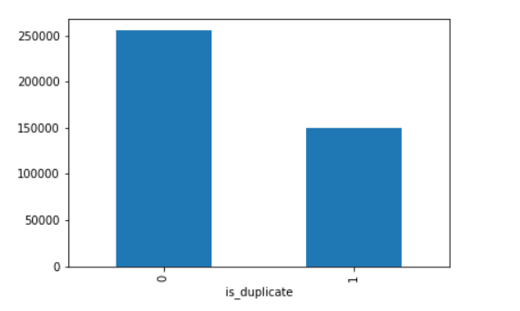
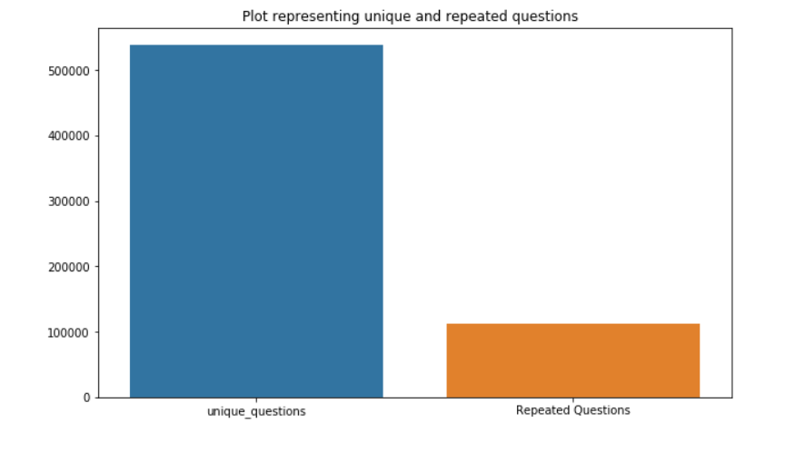
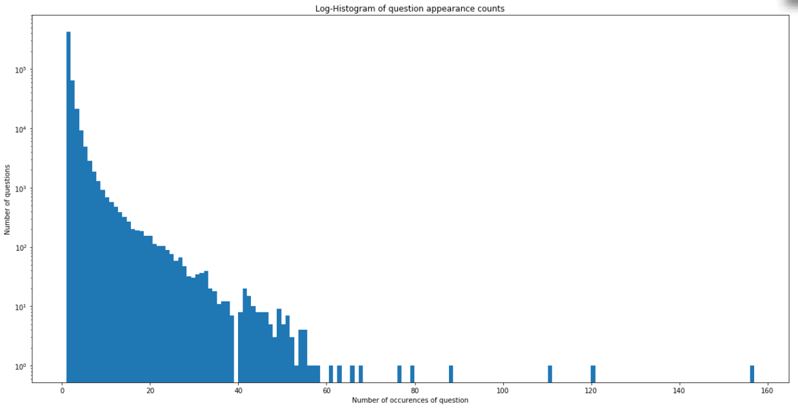
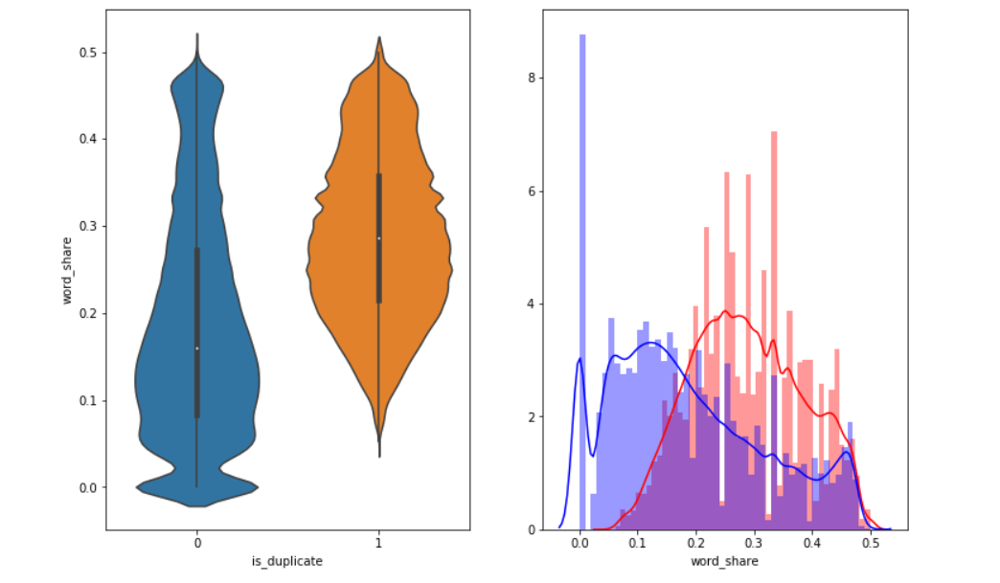
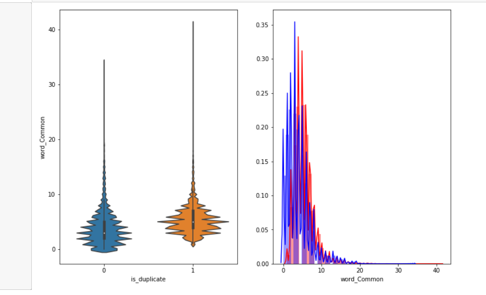

# Quora-Question-pairs

<h1> 1. Business Problem </h1>

<h2> 1.1 Description </h2>

Quora is a place to gain and share knowledge—about anything. It’s a platform to ask questions and connect with people who contribute unique insights and quality answers. This empowers people to learn from each other and to better understand the world.

Over 100 million people visit Quora every month, so it's no surprise that many people ask similarly worded questions. Multiple questions with the same intent can cause seekers to spend more time finding the best answer to their question, and make writers feel they need to answer multiple versions of the same question. Quora values canonical questions because they provide a better experience to active seekers and writers, and offer more value to both of these groups in the long term.

 
> Credits: Kaggle 

  # Problem Statement 
- Identify which questions asked on Quora are duplicates of questions that have already been asked.  
- This could be useful to instantly provide answers to questions that have already been answered.  
- We are tasked with predicting whether a pair of questions are duplicates or not.  

<h2> 1.2 Source</h2>

- Source : https://www.kaggle.com/c/quora-question-pairs

<h2>1.3 Real world/Business Objectives and Constraints </h2>

1. The cost of a mis-classification can be very high.
2. You would want a probability of a pair of questions to be duplicates so that you can choose any threshold of choice.
3. No strict latency concerns.
4. Interpretability is partially important.

<h1>2. Machine Learning Probelm </h1>

<h2> 2.1 Data </h2>

<h3> 2.1.1 Data Overview </h3>

 
- Data will be in a file Train.csv  
- Train.csv contains 5 columns : qid1, qid2, question1, question2, is_duplicate  
- Size of Train.csv - 60MB  
- Number of rows in Train.csv = 404,290

<h3> 2.1.2 Example Data point </h3>

<pre>
"id","qid1","qid2","question1","question2","is_duplicate"
"0","1","2","What is the step by step guide to invest in share market in india?","What is the step by step guide to invest in share market?","0"
"1","3","4","What is the story of Kohinoor (Koh-i-Noor) Diamond?","What would happen if the Indian government stole the Kohinoor (Koh-i-Noor) diamond back?","0"
"7","15","16","How can I be a good geologist?","What should I do to be a great geologist?","1"
"11","23","24","How do I read and find my YouTube comments?","How can I see all my Youtube comments?","1"
</pre>

<h2> 2.2 Mapping the real world problem to an ML problem </h2>

<h3> 2.2.1 Type of Machine Leaning Problem </h3>

 It is a binary classification problem, for a given pair of questions we need to predict if they are duplicate or not. 

<h3> 2.2.2 Performance Metric </h3>

Source: https://www.kaggle.com/c/quora-question-pairs#evaluation

Metric(s): 
* log-loss : https://www.kaggle.com/wiki/LogarithmicLoss
* Binary Confusion Matrix

<h2> 2.3 Train and Test Construction </h2>

  

 We build train and test by randomly splitting in the ratio of 70:30 or 80:20 whatever we choose as we have sufficient points to work with. 

<h1>3. Exploratory Data Analysis </h1>

<h2> 3.1 Reading data and basic stats </h2>

- Number of data points: 404290 

- We get the below information regarding the data
 <class 'pandas.core.frame.DataFrame'>
RangeIndex: 404290 entries, 0 to 404289  
Data columns (total 6 columns): 
 #   Column         Non-Null Count    Dtype  
---  ------         --------------    ----- 
- 0   id             404290 non-null  int64  
- 1   qid1           404290 non-null  int64  
- 2   qid2           404290 non-null  int64  
- 3   question1      404289 non-null  object 
- 4   question2      404288 non-null  object 
- 5   is_duplicate   404290 non-null  int64  
-dtypes: int64(4), object(2) 

- We are given a minimal number of data fields here, consisting of: 

  - id:  Looks like a simple rowID 
  - qid{1, 2}:  The unique ID of each question in the pair 
  - question{1, 2}:  The actual textual contents of the questions. 
  - is_duplicate:  The label that we are trying to predict - whether the two questions are duplicates of each other. 
  
 <h3> 3.2.1 Distribution of data points among output classes</h3>
- Number of duplicate(smilar) and non-duplicate(non similar) questions 
- Plotting the bar graph for duplicate and non duplicate question we get the below graph.

- Total number of question pairs for training:  404290 
- Question pairs are not Similar (is_duplicate = 0):63.08% 
- Question pairs are Similar (is_duplicate = 1): 36.92% 

<h3> 3.2.2 Number of unique questions </h3>

- We find the below information regarding questions. 

  - Total number of  Unique Questions are: 537933 

  - Number of unique questions that appear more than one time: 111780 (20.77953945937505%) 

  - Max number of times a single question is repeated: 157 

- We check if any duplicates are present. 
- A log histograms of question appearance count  are as shown below. 

- We will replace Nan values using ' '. 

- <h2>3.3 Basic Feature Extraction (before cleaning) </h2>

Let us now construct a few features like: 
 - ____freq_qid1____ = Frequency of qid1's
 - ____freq_qid2____ = Frequency of qid2's 
 - ____q1len____ = Length of q1
 - ____q2len____ = Length of q2
 - ____q1_n_words____ = Number of words in Question 1
 - ____q2_n_words____ = Number of words in Question 2
 - ____word_Common____ = (Number of common unique words in Question 1 and Question 2)
 - ____word_Total____ =(Total num of words in Question 1 + Total num of words in Question 2)
 - ____word_share____ = (word_common)/(word_Total)
 - ____freq_q1+freq_q2____ = sum total of frequency of qid1 and qid2 
 - ____freq_q1-freq_q2____ = absolute difference of frequency of qid1 and qid2 
 
 <h3> 3.3.1 Analysis of some of the extracted features </h3>
 
 - Here are some questions have only one single words.
 
 - Minimum length of the questions in question1 :  1 
 - Minimum length of the questions in question2 :  1 
 - Number of Questions with minimum length [question1] : 67 
 - Number of Questions with minimum length [question2] : 24 
 
 - Plotting violin plot of is duplicate vs wordshare and distribution plots of the same we get the below results.
 
 
 
 - The distributions for normalized word_share have some overlap on the far right-hand side, i.e., there are quite a lot of questions with high word similarity 
- The average word share and Common no. of words of qid1 and qid2 is more when they are duplicate(Similar) 

- Now doing the same with word common.We get the below plots.

- The distributions of the word_Common feature in similar and non-similar questions are highly overlapping.

<h2> 3.4 Preprocessing of Text </h2>

- Preprocessing: 

- Here we pre process the below data.
    - Removing html tags  
    - Removing Punctuations 
    - Performing stemming 
    - Removing Stopwords 
    - Expanding contractions etc. 
    
 <h2> 3.5 Advanced Feature Extraction (NLP and Fuzzy Features) </h2>
    
- Function to Compute and get the features : With 2 parameters of Question 1 and Question 2 

Definition:
- __Token__: You get a token by splitting sentence a space
- __Stop_Word__ : stop words as per NLTK.
- __Word__ : A token that is not a stop_word

Features:
- __cwc_min__ :  Ratio of common_word_count to min lenghth of word count of Q1 and Q2  cwc_min = common_word_count / (min(len(q1_words), len(q2_words))
 
 
- __cwc_max__ :  Ratio of common_word_count to max lenghth of word count of Q1 and Q2  cwc_max = common_word_count / (max(len(q1_words), len(q2_words))
 
 
- __csc_min__ :  Ratio of common_stop_count to min lenghth of stop count of Q1 and Q2   csc_min = common_stop_count / (min(len(q1_stops), len(q2_stops))
 
 
- __csc_max__ :  Ratio of common_stop_count to max lenghth of stop count of Q1 and Q2 csc_max = common_stop_count / (max(len(q1_stops), len(q2_stops))
 
 
- __ctc_min__ :  Ratio of common_token_count to min lenghth of token count of Q1 and Q2 ctc_min = common_token_count / (min(len(q1_tokens), len(q2_tokens))
 
 

- __ctc_max__ :  Ratio of common_token_count to max lenghth of token count of Q1 and Q2 ctc_max = common_token_count / (max(len(q1_tokens), len(q2_tokens))
 
 
        
- __last_word_eq__ :  Check if First word of both questions is equal or not last_word_eq = int(q1_tokens[-1] == q2_tokens[-1])
 
 

- __first_word_eq__ :  Check if First word of both questions is equal or not first_word_eq = int(q1_tokens[0] == q2_tokens[0])
 
 
        
- __abs_len_diff__ :  Abs. length difference abs_len_diff = abs(len(q1_tokens) - len(q2_tokens))
 
 

- __mean_len__ :  Average Token Length of both Questions mean_len = (len(q1_tokens) + len(q2_tokens))/2
 
 

- __longest_substr_ratio__ :  Ratio of length longest common substring to min lenghth of token count of Q1 and Q2 longest_substr_ratio = len(longest common substring) / (min(len(q1_tokens), len(q2_tokens))

